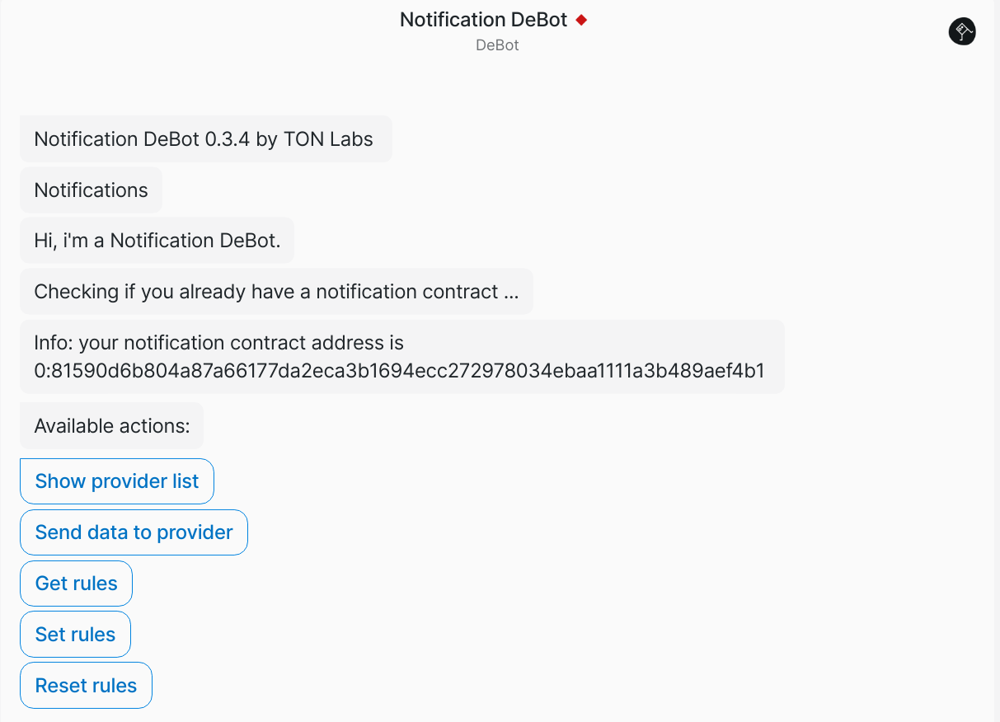
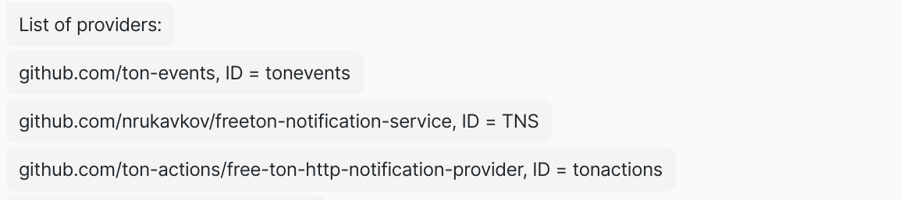
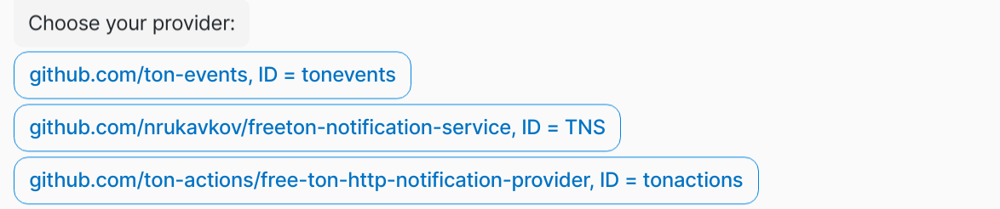
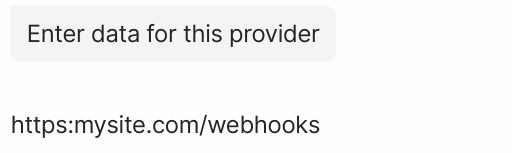
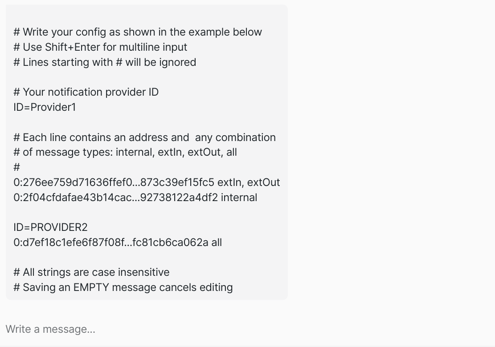

The preferred way to configure the notification service by the user is to use debot.

The preferred way to configure the notification service by the user is to use DeBot wich performs two tasks:

- Allows you to specify your notification rules.

- Informs notification provider where to deliver your messages 

## Step 1. Run DeBot

### Open your Surf wallet and find Notification DeBot 
Debot address: 0:640cb57d316400dd9df639c1a898f267a71e2fa018ba0132ef01104eb3fa86fd or follow the link:

- Mainnet: [https://ton-surf-alpha.firebaseapp.com/debot?address=0%3A640cb57d316400dd9df639c1a898f267a71e2fa018ba0132ef01104eb3fa86fd](https://ton-surf-alpha.firebaseapp.com/debot?address=0%3A640cb57d316400dd9df639c1a898f267a71e2fa018ba0132ef01104eb3fa86fd&net=devnet)
- Devnet: [https://ton-surf-alpha.firebaseapp.com/debot?address=0%3A640cb57d316400dd9df639c1a898f267a71e2fa018ba0132ef01104eb3fa86fd&net=devnet](https://ton-surf-alpha.firebaseapp.com/debot?address=0%3A640cb57d316400dd9df639c1a898f267a71e2fa018ba0132ef01104eb3fa86fd&net=devnet)

DeBot checks if you have a notification contract, otherwise it will deploy it.  You must agree to sign the deployment transaction. In the figure below, DeBot has detected that the notification contract has already been deployed: 



## Step 2. Informs notification provider where to deliver your messages

Select **"Show provider list"**



Select **"Send data to provider"**



Enter the data required by the provider

Lets assume you want to receive http notifications, so enter your site webhook url, and press Enter



DeBot will display your provider response telling you if any further action is needed.
If you have multiple providers, repeat this part for each one.

Congratulations, the first part is done and your providers know where to send notifications for you!

## Step 3. Subscribe on messages

Select **"Set rules"**

DeBot displays a hint on how to set the rules for selecting messages



You should write your rules in a simple text format:

`ID=<providerId>`,  where providerId appears in the "Show provider list" menu

`<address> <msgType, msgType, ...>`, where msgType = extIn | extOut | internal | all

To add the next line, use "Ctrl + Enter", or you may find it easier to write the rules in your preferred editor and just copy and paste them here.

You can configure as many providers as you like, e.g:

```
ID=PROVIDER1
0:e79073de464cd464abcd297fc21ecf91aa829eb71e2ffa9e3a18e66ba7c74ba9 extIn	
0:1bdfca239afc999c8f99a9c1411af4bd229b4bece1506529d760f5fa1d7f4357 extOut, extIn
0:276ee759d71636ffef067c8fa018209f7eb3c9960a27a3c4ebdd73c39ef15fc5 internal	

ID=PROVIDER2
0:c1d6914c067e4acdbe12b72bc597a9a4ec3c88caaca8e85d69f77d2d75fb012f all
```

If you send an empty message, it will not be saved. 

If you want to change the rules, just save new rules again. 

All information is encrypted, so DeBot asks you to “Sign it with Surf” every time you save it.

If you've saved your rules, you're done! The specified provider will receive encrypted messages to be sent to you.

## Change rules or unsubscribe

If you want to unsubscribe and stop receiving notifications, use **"Reset rules"** menu.
